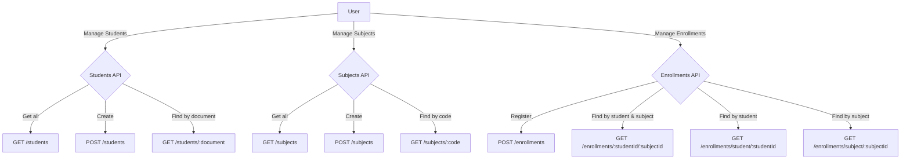

# 📘 Functional Requirements - Students Manager

This document describes the main functional requirements of the **Students Manager** system.  
The system manages three main entities:

- **Students**: Student registration and queries.
- **Subjects**: Subject registration and queries.
- **Enrollments**: Student enrollment into subjects.

---

## 1. Functional Requirements Overview

### Students
- Register a new student.
- Retrieve all students.
- Find a student by document.

### Subjects
- Register a new subject.
- Retrieve all subjects.
- Find a subject by code.

### Enrollments
- Register a new enrollment.
- Find an enrollment by student and subject.
- Find all enrollments by student.
- Find all enrollments by subject.

---

## 2. Use Case Diagram

The following diagram illustrates the **use cases** of the system:

## 3. Flow Diagram

The flow diagram below describes the interaction between the user and the system APIs:

## ✅ Summary

The **Students Manager** system provides functionality to:
- Manage students and their information.
- Manage subjects and their codes.
- Manage student enrollments in subjects.

This documentation provides a functional view of the system with **use case diagrams** and **API flow diagrams**.
